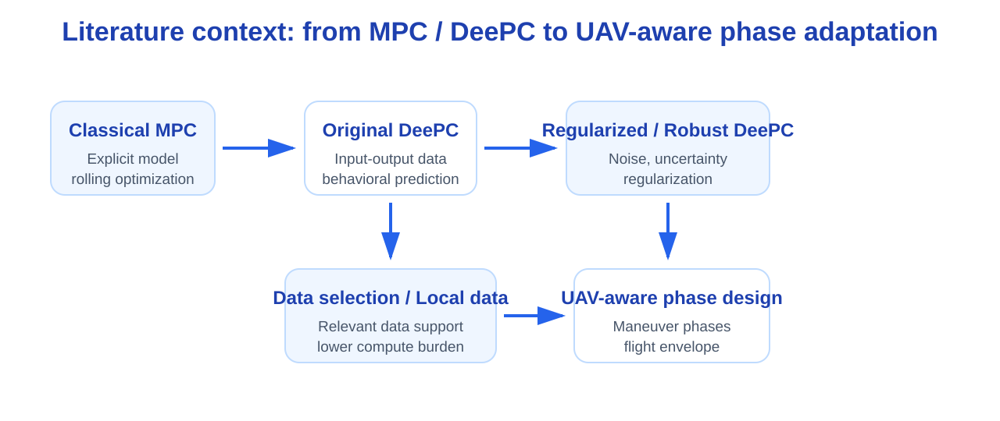
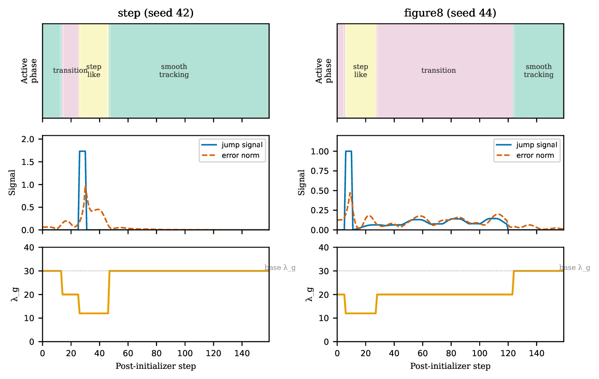
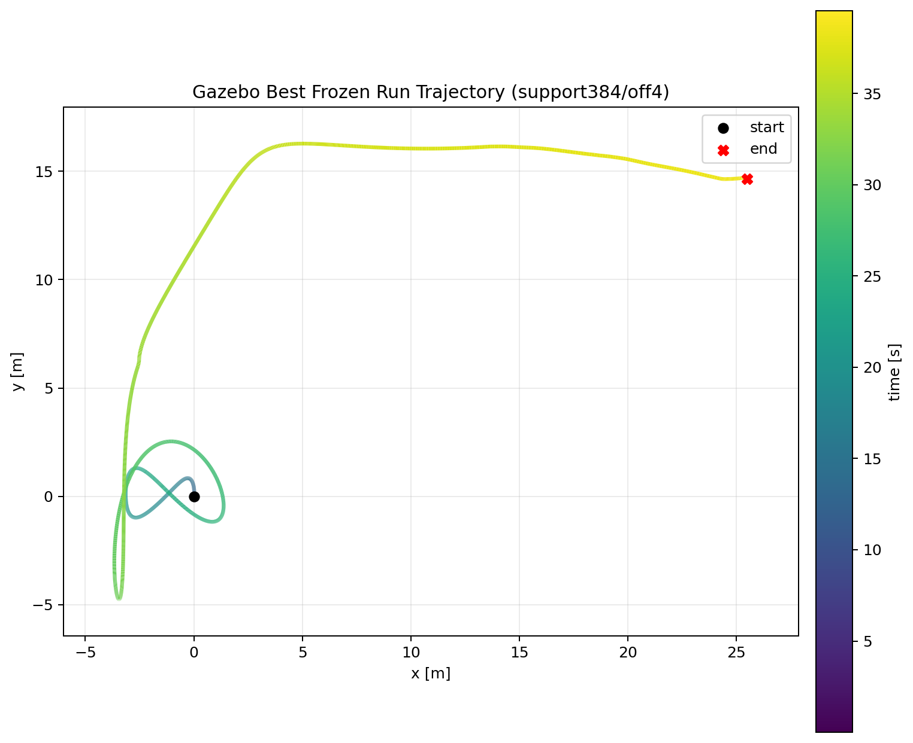

<!-- _class: title -->

# Phase-aware DeePC for Quadcopter Tracking

面向多机动轨迹的无人机数据驱动预测控制  
**选题、实验进展与关键难点**

组会汇报 · DeePC / UAV Tracking / Gazebo Validation

---

# 1. 从 MPC 到 DeePC：基本形式与优化问题

DeePC 可以理解为对传统 MPC 的一种数据驱动改写：**MPC 用显式模型预测未来，DeePC 用历史输入输出数据张成未来轨迹。**

**MPC**

xk+1 = Axk + Buk

基于模型预测未来状态，并求解：

min Σ ||yk − rk||Q2 + Σ ||uk||R2

**DeePC**

[Up;Yp;Uf;Yf]g = [uini;yini;u;y]

用数据矩阵隐式表示系统行为，并求解：

min Σ ||yk − rk||Q2 + Σ ||uk||R2 + λg||g||2 + λy||σy||2

原始 DeePC 工作证明：在线性确定系统中，DeePC 与经典 MPC 存在等价关系；在噪声和非线性场景中，通常需要正则化和鲁棒化处理。

---

# 2. 为什么固定参数可能不够：已有研究基础

这个问题有明确文献背景，不是从零提出。已有研究大致形成了三条线索：

<h3>原始 DeePC</h3>

用输入输出数据直接构造预测控制问题；在线性确定系统中与 MPC 等价。

Coulson, Lygeros, Dörfler, 2019

<h3>Regularized / Robust DeePC</h3>

在噪声、扰动和数据不完美时，通过正则化或 min-max 鲁棒形式提高稳定性。

Coulson et al., 2019; Huang et al., 2021

<h3>Data selection / Local data</h3>

数据越多不一定越好，选择更相关的数据片段可以降低计算量和异常数据影响。

Select-DeePC / online data selection

这些工作说明：DeePC 本身已经不是“一个固定参数跑到底”的方法。正则化强度、数据字典、鲁棒处理和控制约束都会显著影响性能。

---

# 3. 论文简述：原始 DeePC 与鲁棒 DeePC

## Coulson et al., 2019

**核心贡献**

- 用一次历史输入输出数据构造 DeePC 优化问题
- 不显式辨识 A, B, C, D
- 对确定 LTI 系统，可与 MPC 建立等价关系
- 对随机/非线性情形，引入正则化项提高表现

[U_p;Y_p;U_f;Y_f]g = [u_{ini};y_{ini};u;y]

## Huang et al., 2021

**核心贡献**

- 将带噪输入输出数据建模为不确定集
- 用 min-max 优化得到 robust DeePC
- 给出可 tractable reformulation 和性能保证
- 说明 regularized DeePC 可看成 robust DeePC 的一种特例/推广

min_u \; max_{\xi \in \Xi} \; J(u,y,\xi)

Refs: Coulson, Lygeros, Dörfler, “Data-Enabled Predictive Control: In the Shallows of the DeePC”; Huang, Zhen, Lygeros, Dörfler, “Robust Data-Enabled Predictive Control: Tractable Formulations and Performance Guarantees”.

---

# 4. 论文简述：Data selection DeePC 对本项目的启发

## Recent data-selection DeePC

**动机**

- DeePC 的优化维度随数据列数增长
- 数据中可能包含无关片段、异常片段或低质量片段
- 对非线性系统，当前工作点附近或当前任务相关的数据更有用

**典型思路**

- online data selection
- local / relevant trajectory columns
- norm-based 或 embedding-based data selection

## 对 UAV phase-aware DeePC 的启发

**不是所有飞行数据都同等有用**

- smooth tracking 需要平滑稳定数据
- transition 需要包含转弯/加减速的数据
- step-like 需要覆盖目标突变后的恢复过程

D_k = D(φ_k), \quad φ_k \in \{smooth, transition, step-like\}

这自然引出后续的 **phase-dependent local data selection**。

本项目当前先验证 phase-conditioned regularization；如果后续做数据选择，就可以把 Select-DeePC 的“选择相关数据”思想改成“按无人机机动阶段选择相关数据”。

---

# 5. 文献脉络示意

这张图是根据本项目汇报需要重绘的文献脉络示意图，便于说明本工作是在已有 DeePC / robust DeePC / data selection / UAV MPC 基础上的场景化改进。

---

# 6. 从已有研究到 UAV tracking 的切入点

原有研究主要回答：**数据驱动预测控制如何在未知系统、噪声数据或不确定性下工作。**  
本项目更关注：**无人机在不同机动阶段下，DeePC 参数和数据使用是否应该变化。**

**已有思想**

- MPC / DeePC 都是滚动优化
- robust / regularized DeePC 说明正则化很关键
- data selection 说明数据字典需要选择
- gain scheduling / switched MPC 说明不同工作区间可使用不同参数

**UAV-specific 问题**

- 四旋翼通常围绕悬停平衡点运动
- XY 平面和 Z 轴高度控制难度不同
- step / turn / smooth tracking 对控制输入的要求不同
- 安全飞行需要速度、加速度、倾角和输入变化率约束

本项目不是声称“首次提出 phase-aware DeePC”，而是把已有正则化、自适应和数据选择思路具体化到 quadrotor tracking 场景。

---

# 7. 当前选题

## Phase-aware / Maneuver-aware UAV DeePC

研究问题：

> 对于包含 smooth tracking、transition、step-like 等不同阶段的无人机轨迹，是否可以根据当前机动阶段调整 DeePC 的正则化或数据使用方式，从而提升跟踪性能？

对应三个层次：

1. **Phase detector**：识别当前处于哪类机动阶段
2. **Phase-conditioned regularization**：不同阶段使用不同 λg, λy
3. **Phase-dependent data selection**：不同阶段使用不同的数据支持集

---

# 8. 方法框架

相位标签由参考轨迹变化和跟踪误差共同决定：

φk = f(rk, rk−1, ek) ∈ { smooth, transition, step-like }

根据相位 φk 选择 DeePC 参数：

<table class="tbl">
<tr><th>Phase</th><th>λg</th><th>λy</th></tr>
<tr><td>smooth</td><td>30</td><td>1.0e4</td></tr>
<tr><td>transition</td><td>20</td><td>1.2e4</td></tr>
<tr><td>step-like</td><td>12</td><td>1.0e4</td></tr>
</table>

---

# 9. UAV-specific adaptations

在基础 phase-aware DeePC 之上，可以做几类面向四旋翼的特殊适配：

**Hover-centered input**

- 不直接优化绝对控制量，而是优化相对悬停输入的增量

uk = uhover + Δuk

**Flight-envelope constraints**

- 对速度、加速度、推力、倾角、输入变化率加约束
- 避免 DeePC 为追踪误差给出过激控制量

Δuk ∈ Usafe, &nbsp; yk ∈ Ysafe

这样做以后，方法就不是简单的 phase-aware DeePC，而是结合了四旋翼悬停平衡点、飞行包线和执行安全约束的 UAV-aware DeePC。

---

# 10. UAV-specific data and phase design

1. **Phase-balanced data dictionary**  
   数据集中不能只有平滑飞行，还需要覆盖转弯、加减速、阶跃响应等机动片段。

2. **Trajectory-geometry phase detector**  
   相位不只由误差决定，也由参考轨迹的速度、加速度、曲率或目标跳变决定。

φk = f(vrefk, arefk, κrefk, ek)

3. **Axis-aware weighting**  
   四旋翼的 XY 平面运动和 Z 轴高度控制难度不同，可以对 XY / Z 误差设置不同权重。

||yk − rk||Q2 = qxy ||exy||2 + qz ez2

---

# 11. 方法图

---

# 12. 已有实验设置

实验采用最终协议 A：

**轨迹任务**

- step
- figure8

**随机种子**

- 41–50，共 10 个 seed

**A1: Static DeePC**

- 固定 λg=30
- 固定 λy=1e4

**A2: Maneuver-aware DeePC**

- smooth: 30 / 1e4
- transition: 20 / 1.2e4
- step-like: 12 / 1e4

---

# 13. 多 seed 结果

<table class="tbl">
<tr>
<th>Trajectory</th>
<th>Static Position RMSE</th>
<th>Maneuver-aware Position RMSE</th>
<th>Paired Result</th>
</tr>
<tr>
<td><strong>figure8</strong></td>
<td>0.0868 ± 0.0096</td>
<td class="good">0.0647 ± 0.0067</td>
<td class="good">10 / 10 wins</td>
</tr>
<tr>
<td><strong>step</strong></td>
<td>0.1364 ± 0.0234</td>
<td class="good">0.1046 ± 0.0133</td>
<td class="good">10 / 10 wins</td>
</tr>
</table>

---

# 14. 主结果图

---

# 15. Phase timeline 图

用途：说明 online phase switching 是实际控制过程中的切换，不是事后重新标注。

---

# 16. 结果如何解释

当前结果支持的结论：

- 固定参数 DeePC 在不同轨迹类型之间存在折中
- phase-conditioned regularization 能在 step 和 figure8 上稳定降低 RMSE
- 这说明“相位感知”方向有继续做的价值

当前结果还不能直接说明：

- local data selection 一定有效
- phase detector 已经足够可迁移
- Gazebo / ROS 中能保持同样收益

后续重点不是继续盲目加轨迹，而是把机制解释和验证链路补完整。

---

# 17. 需要补的评价指标

<h3>整体指标</h3>
<ul>
<li>Tracking RMSE</li>
<li>Position RMSE</li>
<li>Max error</li>
</ul>

<h3>分阶段指标</h3>
<ul>
<li>Smooth RMSE</li>
<li>Transition RMSE</li>
<li>Step-like RMSE</li>
</ul>

<h3>求解指标</h3>
<ul>
<li>Mean solve time</li>
<li>Max solve time</li>
<li>Failure count</li>
</ul>

如果提升主要来自 transition 或 step-like 阶段，才能更有力地支撑 phase-aware 的研究动机。

---

# 18. 难点一：相位定义不能太启发式

相位标签需要满足：

1. **可解释**：能对应轨迹几何或控制困难
2. **可复现**：不同 seed 和不同轨迹下定义一致
3. **可在线获得**：不能依赖未来信息或离线标签

φk = f( ||rk − rk−1||, ||rk − 2rk−1 + rk−2||, ||ek|| )

---

# 19. 难点二：数据越干净不一定越好

DeePC 依赖数据字典覆盖系统行为。采集数据时存在一个矛盾：

- excitation 太强：轨迹看起来脏，可能污染数据
- excitation 太弱：数据缺少充分激励，后续优化容易不可行

data quality &nbsp; vs. &nbsp; persistence of excitation

已有现象：去掉 excitation 后，采集轨迹更干净，但后续 DeePC 执行明显变差，甚至出现 infeasible。

---

# 20. 难点三：horizon 和数据集匹配

预测时域 N 不是单调调参旋钮。

- N 太短：预测能力不足
- N 太长：优化规模增大，数值问题和数据不匹配更明显
- 不同任务对 N 的需求不同

Ndataset = Ncontroller

---

# 21. 难点四：Gazebo / ROS 验证

Gazebo 验证的目标不是刷主结果，而是说明方法能进入更真实的控制链路。

需要注意：

- 使用 /clock，不能用 wall-clock 驱动控制步
- 参考轨迹索引要避免浮点 floor jitter
- 在线历史数据要满足因果关系

history should record (uk−1, yk), not (uk, yk)

---

# 22. Gazebo 轨迹预览

---

# 23. 下一步计划

1. 固定公平 baseline，避免 static DeePC 太弱
2. 补充 phase-resolved RMSE 和 phase occupancy
3. 完成 A1 / A2 / A4 / A5 消融
4. 检查数据采集中的 excitation 强度
5. 做 Gazebo closeout：时间同步、因果记录、控制频率

---

# 24. 总结

- 当前项目不应表述为“复现 DeePC 无人机控制器”
- 更合适的表述是：**面向多机动阶段的 phase-aware UAV DeePC**
- 已有结果显示 A2 在 step 和 figure8 上稳定优于 static DeePC
- 后续关键是解释收益来源，并保证 Gazebo 验证不被时间和数据问题干扰

希望讨论：后续优先补 A4/A5 消融，还是先完成 Gazebo closeout？

