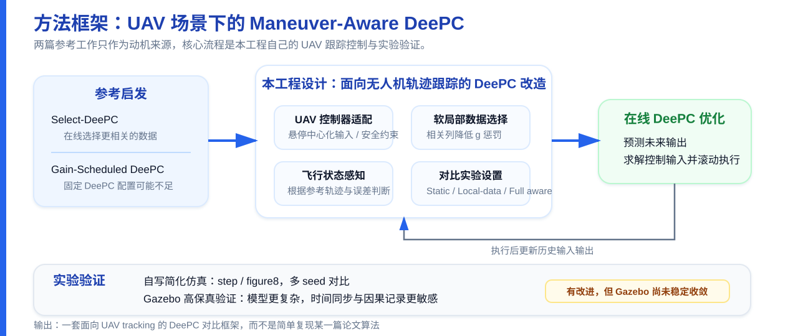
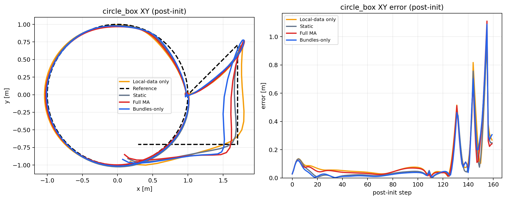
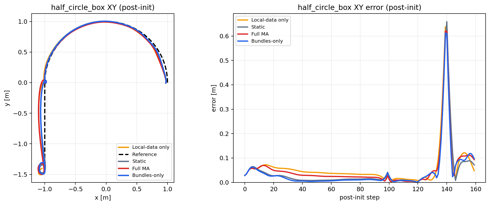
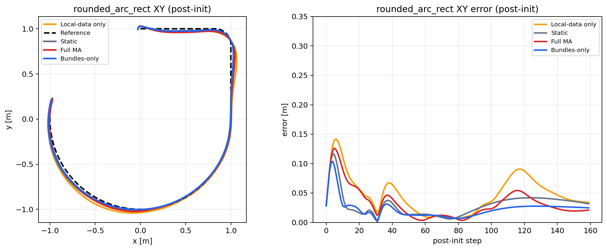
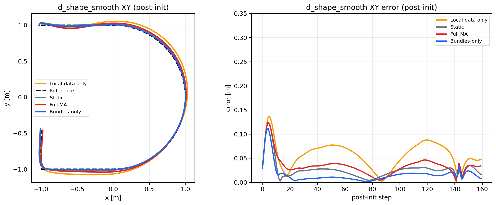

<!-- _class: title -->

# Phase-aware DeePC for Quadcopter Tracking

面向多机动轨迹的无人机数据驱动预测控制  
**选题、实验进展与关键难点**

组会汇报 · DeePC / UAV Tracking / Gazebo Validation

---

# 1. 从 MPC 到 DeePC：基本形式与优化问题

DeePC 可以理解为对传统 MPC 的一种数据驱动改写：**MPC 用显式模型预测未来，DeePC 用历史输入输出数据张成未来轨迹。**

**MPC**

xk+1 = Axk + Buk

基于模型预测未来状态，并求解：

min Σ ||yk − rk||Q2 + Σ ||uk||R2

**DeePC**

[Up;Yp;Uf;Yf]g = [uini;yini;u;y]

用数据矩阵隐式表示系统行为，并求解：

min Σ ||yk − rk||Q2 + Σ ||uk||R2 + λg||g||2 + λy||σy||2

原始 DeePC 工作给出了数据驱动 MPC 的基本框架。后续工作进一步关注：非线性系统中如何选择数据、如何根据工作区域切换局部 DeePC 表示。

---

# 2. 参考工作一：Select-DeePC / Online Data Selection

Select-DeePC 关注的是非线性系统中的 DeePC 控制问题。如果一直使用同一个全局 Hankel 数据集，其中会包含大量和当前控制任务关系不大的数据，可能导致预测质量下降，也会增加优化中的数据失配。也就是**当前控制任务应优先使用当前更相关的数据**。

该工作来自 DeePC 原作者 Florian Dörfler。

本文先估计当前参考在数据字典中的投影系数，再用这个系数判断哪些 Hankel 列对当前参考更有贡献。具体实现不是直接删除不相关列，而是把原来的 g 正则化项改成带列权重的形式：

λg ||g||22 → λg ||Wk1/2g||22 = λg Σi wigi2

相关列：wi=1，惩罚较小；不相关列：wi=woff&gt;1，惩罚较大。这样优化器会优先使用相关 Hankel 列，但仍保留其他列作为备选。

Ref: Näf, Moffat, Eising, Dörfler, “Choose Wisely: Data-Enabled Predictive Control for Nonlinear Systems Using Online Data Selection”, 2025. 本文实现为基于参考投影系数的软局部数据选择。

---

# 3. 参考工作二：Gain-Scheduled DeePC（动机参考）

## 文献大概内容
**核心思想**
- 它认为 DeePC 原本更适合线性系统，但很多真实系统是非线性的，而且系统行为会随运行状态变化。于是它让 DeePC 根据一个可以测量的变量，在线切换不同的局部 Hankel 数据矩阵。

##  启发

**无人机的 轨迹类型 可作为调度变量**

- 同一套 DeePC 参数，在平稳跟踪、转弯、折弯里，不一定都合适。

(λg, λy)k 由 φk 查表选择

这对应本文的 **phase-conditioned regularization**。

Ref: Guerrero, Lakshminarayanan, Rojas, “Gain-Scheduled Data-Enabled Predictive Control: A DeePC Approach for Nonlinear Systems”, 2025.

---

# 4. UAV-specific controller adaptations

为了把这两篇文章的方案挪到UAV上来，所以做了一些修改

**1. Hover-centered input**

不直接优化绝对控制量，而是优化相对悬停输入的增量：

uk = uhover + Δuk

把控制量限制在悬停附近，减少无意义的大推力偏置。

**2. Flight-envelope constraints**

加入 UAV 执行安全边界：

Δuk ∈ Usafe, &nbsp; yk ∈ Ysafe

约束对象包括输入幅值、输入变化率、速度/加速度上界和轨迹误差边界。

区别：这一页处理的是 controller formulation，即 DeePC 优化变量、输入形式和安全约束如何适配 UAV。

---

# 5. UAV-specific phase/data design

更进一步，要把 DeePC 数据与 UAV 适配：把无人机轨迹几何特征显式用于此前的 Select-DeePC 和 Gain-Scheduled DeePC 中。主要修改包括：

1. 按 smooth / transition / step-like 组织飞行数据，使数据集中不仅有平滑飞行，也覆盖转弯、加减速和阶跃恢复过程。

2. 相位标签由参考速度、参考加速度、曲率或目标跳变以及跟踪误差共同决定。

φk = f(vrefk, arefk, κrefk, ek)

3. 单独分离 XY 平面误差和 Z 轴高度误差的权重设计

总而言之，本研究参考 Select-DeePC 和 Gain-Scheduled DeePC，特别面向无人机轨迹特征，设计了 **Maneuver-aware DeePC** 也就是 **机动感知 DeePC**。

---
<!-- _class: method-overview -->

---

# 7. 仿真环境多 seed 结果

用轻量 Python 仿真环境做仿真：

**仿真环境**
- 使用 data-driven-mpc 工程提供的 python 仿真模型进行仿真，之后移植到 gazebo 验证
- 控制器：A1 Static DeePC vs A2 Maneuver-aware DeePC
- 使用MPC控制器做轨迹数据采集

**设置说明**

- 按 smooth / transition / step-like 切换参数
- 目的：验证 phase-conditioned regularization 是否带来稳定收益

---

# 8. Gazebo-shape 简化仿真：Circle-Box / Half-Circle-Box 消融

四方法分别为：Static、Local-data only、Bundles-only、Full Maneuver-Aware。当前这两条相位变化更明显的轨迹上，<strong>Bundles-only</strong> 都是最优。

---

# 9. Gazebo-shape 简化仿真：Rounded-Arc-Rect / D-Shape 消融

---

# 11. Gazebo-shape 简化仿真：四方法结论表

<table class="tbl compact">
<tr>
<th>Trajectory</th>
<th>Static</th>
<th>Local-data only</th>
<th>Bundles-only</th>
<th>Full MA</th>
</tr>
<tr>
<td><strong>circle_box</strong></td>
<td class="bad">0.3031</td>
<td>0.2266</td>
<td>0.2285</td>
<td class="good">0.1849</td>
</tr>
<tr>
<td><strong>half_circle_box</strong></td>
<td class="bad">0.2553</td>
<td>0.1759</td>
<td>0.1816</td>
<td class="good">0.1400</td>
</tr>
<tr>
<td><strong>rounded_arc_rect</strong></td>
<td class="bad">0.3157</td>
<td>0.2249</td>
<td>0.2112</td>
<td class="good">0.1565</td>
</tr>
<tr>
<td><strong>d_shape_smooth</strong></td>
<td class="bad">0.4780</td>
<td>0.3389</td>
<td>0.2940</td>
<td class="good">0.2138</td>
</tr>
</table>

---

# 12. 移植到 Gazebo

将前面的 DeePC 方案移植到 Gazebo 后，quadrotor tracking 问题比自写简化仿真更难，主要差别在于：

- Gazebo存在电机/推力响应、饱和和姿态耦合，且轨迹误差会被低层控制器和模型延迟放
- 数据采集和执行不是同一个理想离散系统，控制命令需要经过 ROS/Gazebo 的执行链路，中间套了一层控制器
- 简化仿真中的参数不一定能直接迁移到 Gazebo
- Gazebo仿真要求实时控制，但是实时计算频率最高只能到5Hz左右

---

# 14. Gazebo Circle-Box 对比：Static vs Maneuver-Aware

**XY 轨迹叠加对比**

**误差曲线叠加对比**

---

# 16. Gazebo Circle-Easy 方法消融

<table class="tbl compact">
<tr>
<th>Variant</th>
<th>XY RMSE (m)</th>
<th>Max XY error (m)</th>
<th>Solver ms</th>
</tr>
<tr>
<td>Static DeePC</td>
<td>0.77166</td>
<td>3.000</td>
<td>28.334</td>
</tr>
<tr>
<td>Local-data only</td>
<td class="good">0.40831</td>
<td class="good">0.994</td>
<td>16.176</td>
</tr>
<tr>
<td>Full Maneuver-Aware</td>
<td>0.71303</td>
<td>2.604</td>
<td class="good">15.145</td>
</tr>
</table>

这组消融说明：当前 Gazebo circle 上收益主要来自 local-data selection；完整 maneuver-aware bundle 没有稳定成为最优。

---

# 18. Circle-Box 不同 Horizon 对比：N=25 vs N=40 vs N=80

<table class="tbl compact">
<tr>
<th>Setting</th>
<th>XY RMSE (m)</th>
<th>Max XY error (m)</th>
<th>Solver ms</th>
</tr>
<tr>
<td>N=25</td>
<td>7.63435</td>
<td>10.944</td>
<td>51.147</td>
</tr>
<tr>
<td>N=40</td>
<td class="good">6.22933</td>
<td class="good">9.231</td>
<td>71.598</td>
</tr>
<tr>
<td>N=80</td>
<td class="bad">19.33523</td>
<td class="bad">26.368</td>
<td class="bad">148.196</td>
</tr>
</table>

`N=40` 是当前 `circle_box` 上更合理的平衡点；`N=80` 解算更慢，轨迹也明显发散。

---

<!-- _class: title -->

# 5.30比赛技术总结

无人机空地协同赛项  
**软件链路、重定位与穿环识别**

Point-LIO / Super Planner / MPC / MAVROS / PX4

---

# 19. 比赛任务与平台简介

**任务内容**

- 自主起飞
- 避让方形障碍柱
- 穿越方框障碍
- 识别地面二维码
- 返程再次穿越方框障碍
- 返回起始区完成抵近扎气球

**平台与约束**

- 250 级 X 型四旋翼平台
- 比赛中不能依赖外部定位
- 必须依靠机载传感器完成定位、规划和控制
- 核心是完整自主飞行软件链路

本次比赛的主要难点不是单个算法，而是定位、规划、控制和飞控执行之间的链路稳定性。

---

# 20. 无人机自主飞行软件链路

**系统构成**

- Point-LIO：雷达惯性定位
- 重定位模块：对齐全局地图
- Super Planner：轨迹规划
- MPC：轨迹跟踪控制
- MAVROS + PX4：控制指令到飞控执行
- 机载点云处理：穿环识别与辅助定位

Livox 雷达 / IMU 
↓ 
Point-LIO 实时定位 
↓ 
重定位模块对齐全局地图 
↓ 
Super Planner 生成可行轨迹 
↓ 
MPC 跟踪轨迹 
↓ 
MAVROS → PX4 执行

---

# 21. 技术难点一：重定位

Point-LIO 输出的是局部里程计坐标系下的位姿，而比赛任务需要无人机知道自身在预先地图中的位置。因此系统中加入重定位模块，用于建立局部 odom 与全局 map 之间的关系。

**核心流程**

1. 加载预先扫描的 PCD 全局点云地图
2. 去掉无用、可变结构，只保留天花板等稳定结构
3. 累积局部点云
4. 在 BEV 平面上估计 yaw 和 x/y 初值

**配准与发布**

5. 使用 ICP / point-to-plane ICP / GICP refine
6. 通过 fitness、RMSE、overlap 选择最佳候选
7. 成功后发布全局定位结果

Point-LIO 解决“相对起点移动了多少”，重定位解决“当前在全局地图哪里”。

---

# 22. 重定位解决的问题

**比赛中的实际问题**

- 无人机初始摆放位置不完全固定
- 无人车和无人机可能处在不同局部坐标系
- 仅依赖 Point-LIO 局部 odom 时，目标点无法直接统一
- 扎气球任务需要无人机和无人车共享同一世界坐标

**重定位的作用**

- 将无人机局部 odom 对齐到全局 map
- 统一无人机和无人车的世界坐标
- 为 Super Planner 提供全局一致的起点和目标点
- 支撑返航、穿环和扎气球任务

这一步的核心价值是把“局部可飞”变成“在比赛场地全局坐标下可执行任务”。

---

# 23. 技术难点二：穿环识别

方框障碍的位置可能变化，不能完全依赖预设坐标。因此穿环部分采用基于雷达点云的识别方法。

**识别流程**

1. 根据环可能存在的世界坐标，在点云中设置大致 ROI
2. 使用 RANSAC 对方框结构进行拟合
3. 根据拟合出的边框点计算方框中心
4. 将方框中心沿法向量偏移适当距离
5. 作为 Super Planner 的目标点进行规划穿越

全局重定位 
↓ 
稳定 ROI 
↓ 
RANSAC 拟合方框 
↓ 
计算中心与法向偏移点 
↓ 
Planner 目标点

基于重定位后的点云 ROI 能缩小搜索范围，提高检测稳定性；RANSAC 用于从局部点云中提取方框结构。

---

# 24. 比赛技术总结

**已形成的系统链路**

- Point-LIO 提供实时定位
- 重定位统一全局坐标
- Super Planner 生成避障和穿环轨迹
- MPC 进行轨迹跟踪
- MAVROS / PX4 完成底层执行

**主要技术难点**

- Point-LIO 与重定位的稳定性
- 坐标系与话题接口一致性
- 基于点云的方框障碍识别
- 穿环目标点生成与轨迹跟踪
- 无人机与无人车坐标统一后的扎气球任务

后续优化重点：定位坐标系固化、重定位成功率提升、ROI + RANSAC 穿环识别鲁棒性提升。

