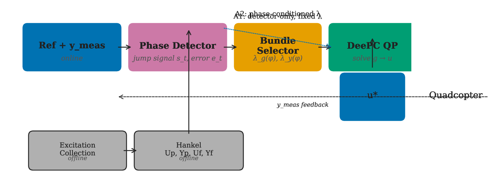
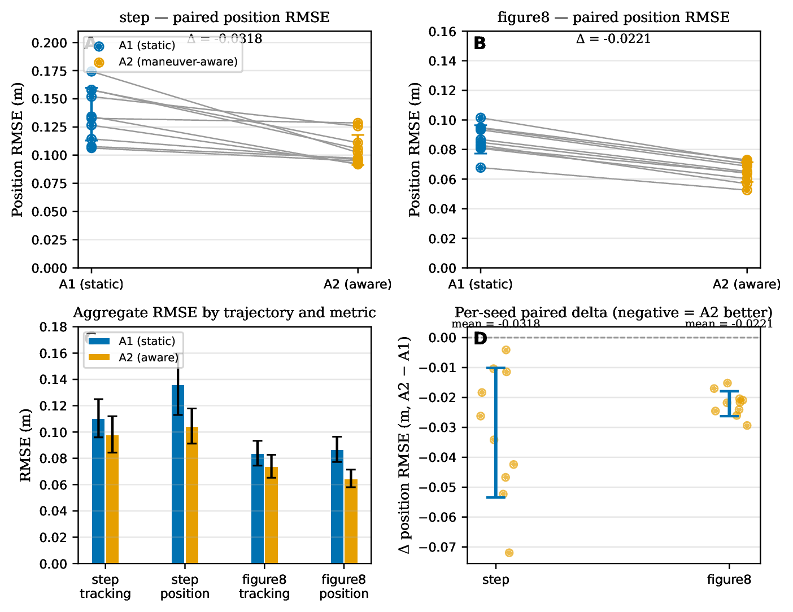
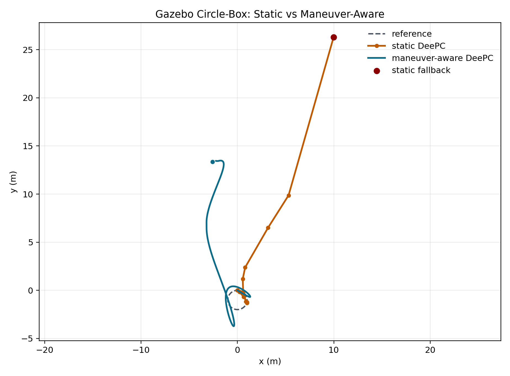
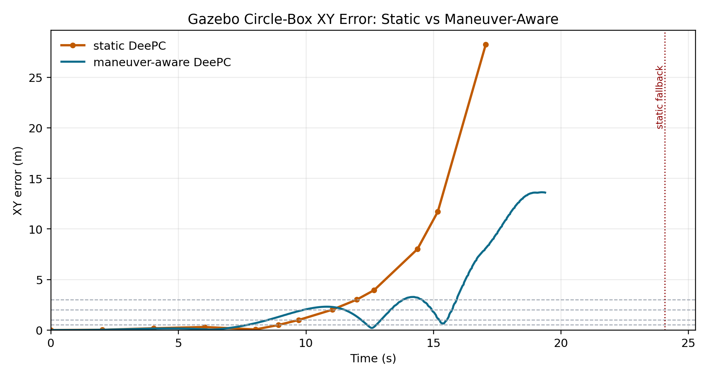
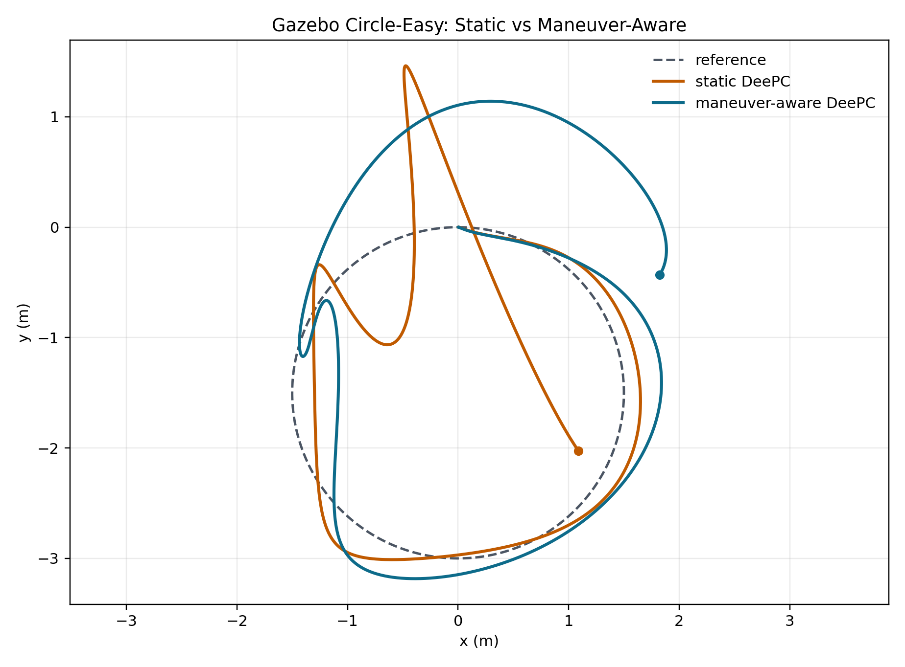
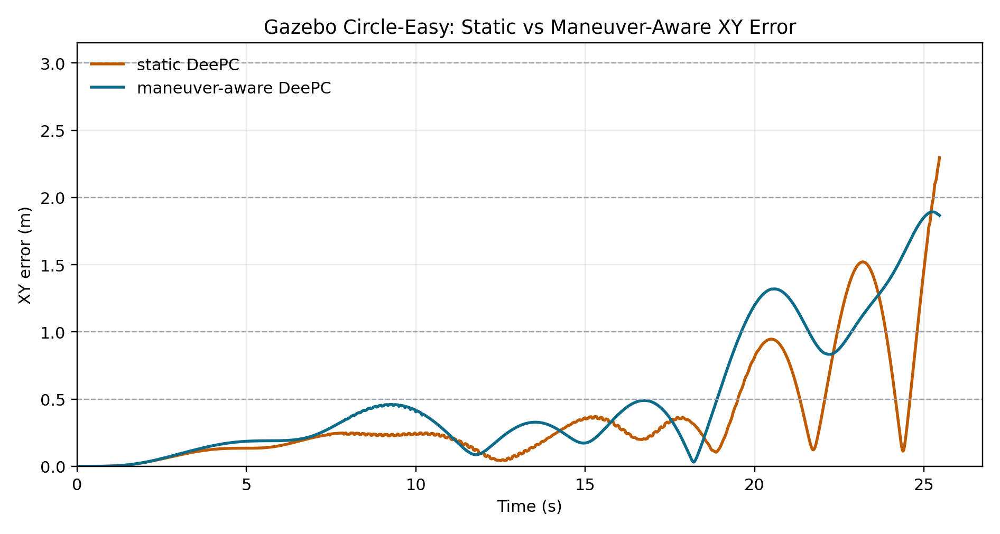
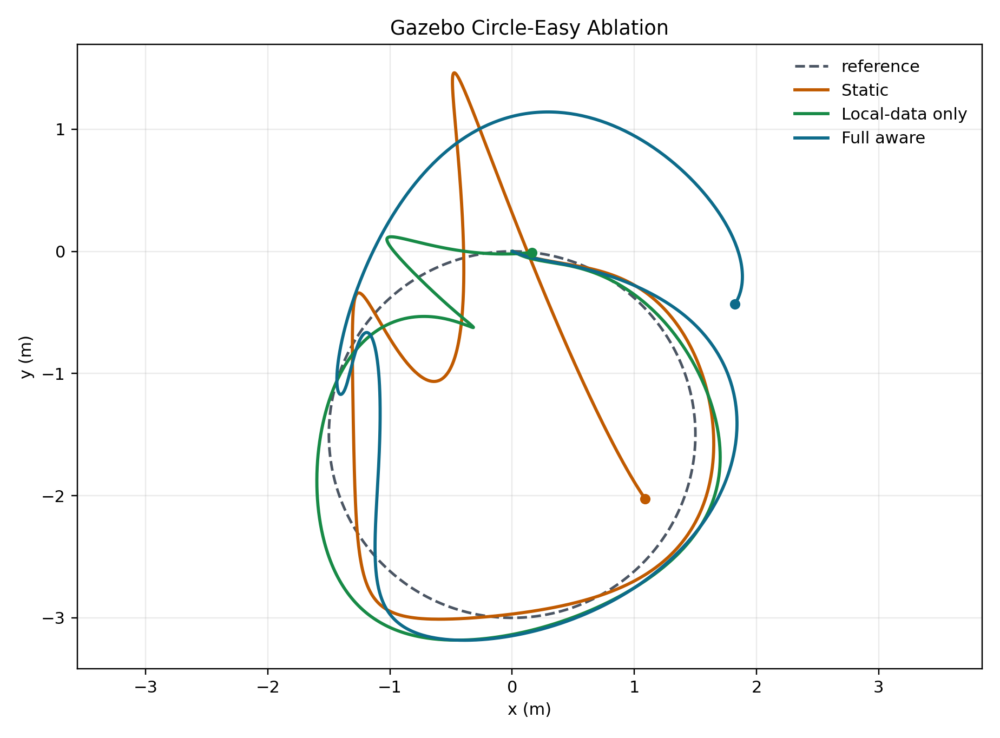
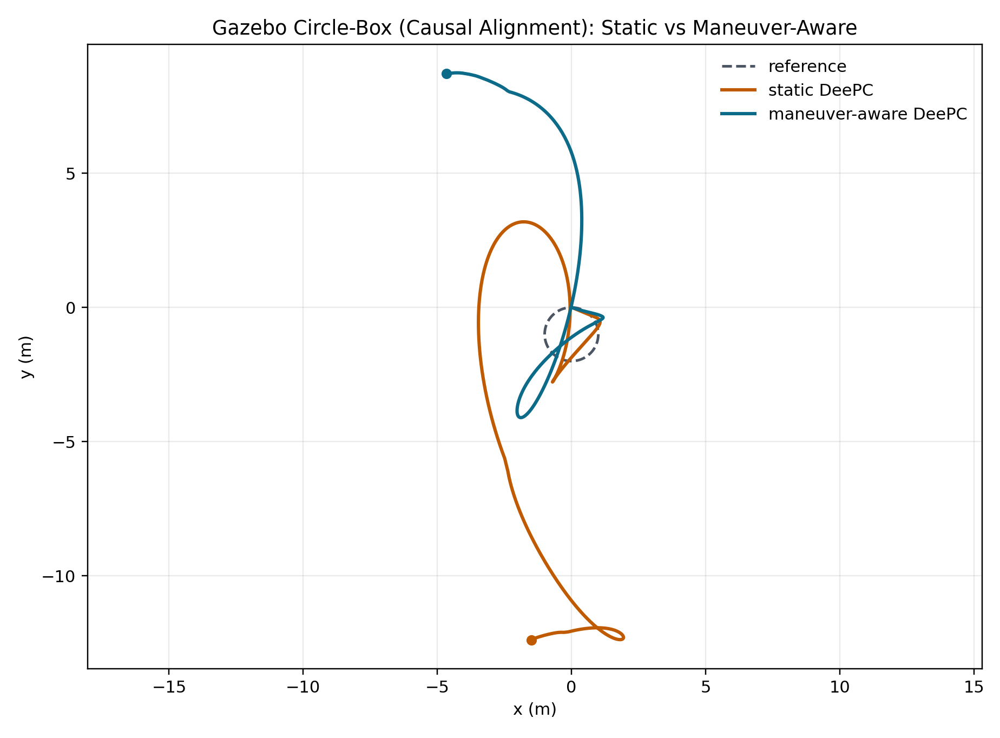
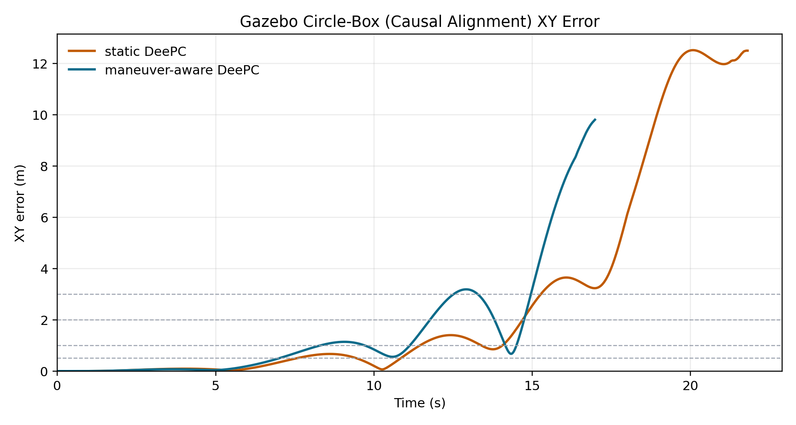
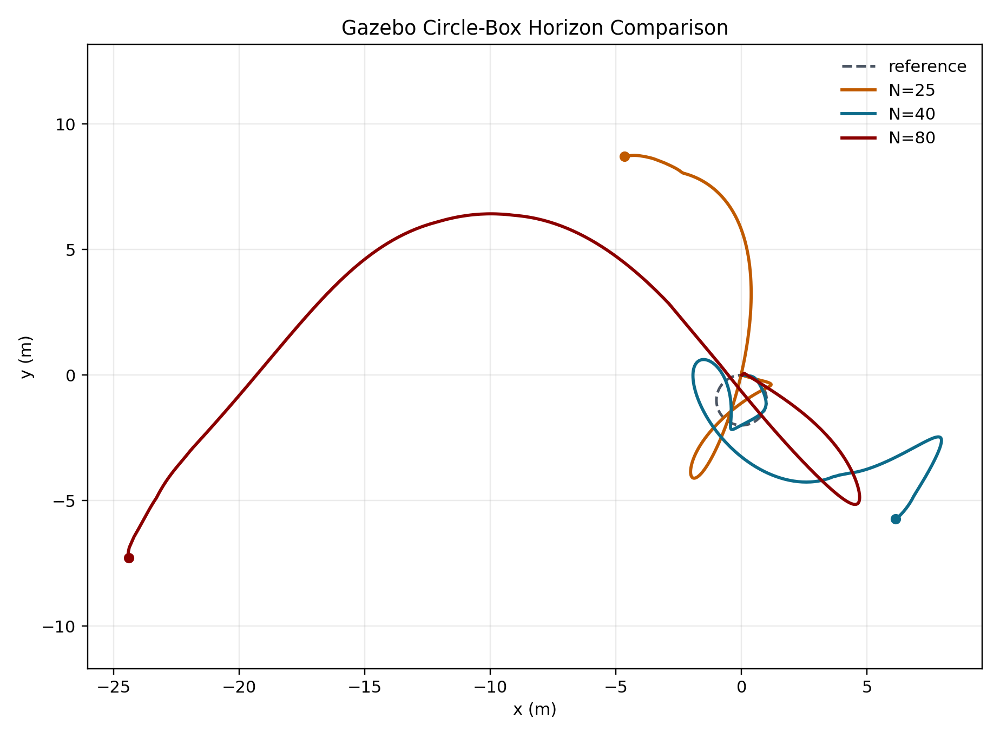

<!-- _class: title -->

# Phase-aware DeePC for Quadcopter Tracking

面向多机动轨迹的无人机数据驱动预测控制  
**选题、实验进展与关键难点**

组会汇报 · DeePC / UAV Tracking / Gazebo Validation

---

# 1. 从 MPC 到 DeePC：基本形式与优化问题

DeePC 可以理解为对传统 MPC 的一种数据驱动改写：**MPC 用显式模型预测未来，DeePC 用历史输入输出数据张成未来轨迹。**

**MPC**

xk+1 = Axk + Buk

基于模型预测未来状态，并求解：

min Σ ||yk − rk||Q2 + Σ ||uk||R2

**DeePC**

[Up;Yp;Uf;Yf]g = [uini;yini;u;y]

用数据矩阵隐式表示系统行为，并求解：

min Σ ||yk − rk||Q2 + Σ ||uk||R2 + λg||g||2 + λy||σy||2

原始 DeePC 工作给出了数据驱动 MPC 的基本框架。后续工作进一步关注：非线性系统中如何选择数据、如何根据工作区域切换局部 DeePC 表示。

---

# 2. 参考工作一：Select-DeePC / Online Data Selection

## Choose Wisely, 2025

**为什么参考它**

- 主题直接对应：online data selection for DeePC
- Florian Dörfler 是 DeePC 原始方向的重要作者之一
- 核心思想：每个时刻只使用与当前任务更相关的数据
- 面向非线性系统，避免固定全局 Hankel 数据集带来的冗余和失配

**本文没有照搬其算法**，而是采用“基于参考投影系数的局部数据选择”。这里的 support 指某列数据对当前参考重构的贡献度。

## 本文数据选择公式

先用当前参考构造一个参考一致的 DeePC 系数：

gr = H† [uini; yini; uref; yref]

用系数幅值作为 Hankel 列相关性评分：

si = |(gr)i|,&nbsp;&nbsp; Ik = TopKi(si)

在 DeePC 中降低被选列的 g 正则化惩罚：

λg ||Wk1/2g||22,&nbsp;&nbsp; wi=1 if i∈Ik, else wi=woff

Ref: Näf, Moffat, Eising, Dörfler, “Choose Wisely: Data-Enabled Predictive Control for Nonlinear Systems Using Online Data Selection”, 2025. 本文实现为基于参考投影系数的软局部数据选择。

---

# 3. 参考工作二：Gain-Scheduling DeePC

## GS-DeePC, 2025

**核心思想**

- 非线性系统存在明显 operating-region dependence
- 不使用一个全局 Hankel 矩阵
- 按可测 scheduling variable 划分局部工作区域
- 每个区域构造局部 Hankel 数据表示
- 通过区域切换处理非线性系统控制

## 对本项目的启发

**无人机也有类似“工作区域/机动阶段”**

- smooth：稳定跟踪，控制输入应更平滑
- transition：曲率或速度方向变化，预测误差容易放大
- step-like：目标突变，重点是减少超调和恢复时间

(λ_g, λ_y)_k = (λ_g, λ_y)(φ_k)

这对应 **maneuver-aware parameter scheduling**。

Ref: Zieglmeier et al., “Gain-Scheduling Data-Enabled Predictive Control for Nonlinear Systems with Linearized Operating Regions”, 2025.

---

# 4. 从已有研究到 UAV tracking 选题

两篇近期工作给出的共同启发：**DeePC 的数据和参数可以随系统状态、任务上下文或工作区域变化。**  
本项目将这一思想迁移到无人机轨迹跟踪中的机动阶段切换。

**已有工作关注**

- Select-DeePC：按当前任务选择相关数据
- GS-DeePC：按工作区域切换局部 DeePC 表示
- 共同目标：提升非线性系统中的预测准确性和优化可行性

**本文选题**

> 对于 smooth、transition、step-like 等不同轨迹阶段，是否可以根据当前阶段调整 DeePC 的正则化参数和数据支持，从而提升无人机轨迹跟踪性能？

本项目不是重新提出 DeePC，而是形成 UAV-aware phase-conditioned DeePC：按无人机轨迹阶段定义 phase，并加入 hover-centered input、飞行包线约束和 phase-dependent data interface。

---

# 5. 方法框架：公式来源与参数调度

相位变量 φk 不是从某篇论文中直接照搬的公式，而是把两篇参考工作的思想映射到 UAV 轨迹跟踪中：

<table class="tbl compact">
<tr><th>来源</th><th>文献中的思想</th><th>本文中的映射</th></tr>
<tr><td>Select-DeePC</td><td>每个时刻根据当前轨迹选择相关数据列</td><td>不同 UAV phase 对应不同数据相关性：Dk=D(φk)</td></tr>
<tr><td>GS-DeePC</td><td>用 measurable scheduling variable 选择局部 Hankel 表示</td><td>用可在线计算的 trajectory phase 作为 scheduling variable</td></tr>
<tr><td>本文 UAV 设计</td><td>参考轨迹几何与跟踪误差可直接在线获得</td><td>φk=f(rk, rk−1, ek)</td></tr>
</table>

φk = f(rk, rk−1, ek) ∈ { smooth, transition, step-like }

---

# 6. 方法框架：超参数选择理由

当前先验证 phase-conditioned regularization，因此根据 phase 选择 DeePC 正则化参数：

<table class="tbl compact">
<tr><th>Phase</th><th>λg</th><th>λy</th><th>选择理由</th></tr>
<tr><td>smooth</td><td>30</td><td>1.0e4</td><td>沿用 static baseline；较强 g 正则化抑制过拟合和输入抖动</td></tr>
<tr><td>transition</td><td>20</td><td>1.2e4</td><td>降低 λg 提高响应灵活性；提高 λy 容忍轨迹切换时的数据不匹配</td></tr>
<tr><td>step-like</td><td>12</td><td>1.0e4</td><td>进一步降低 λg，避免目标突变时控制过于保守；λy 保持 baseline 防止误差被过度松弛</td></tr>
</table>

这组参数不是理论最优解，而是基于 static baseline 和初步参数扫描得到的经验折中。后续需要通过更系统的网格搜索、phase-resolved 指标和消融实验确认泛化性。

---

# 7. UAV-specific controller adaptations

这一页讲的是**控制器层面的 UAV 适配**：把 DeePC 的输入、约束和安全边界改成更符合四旋翼执行特性的形式。

**1. Hover-centered input**

本文不直接优化绝对控制量，而是优化相对悬停输入的增量：

uk = uhover + Δuk

这样可以把控制量限制在悬停附近，减少无意义的大推力偏置。

**2. Flight-envelope constraints**

本文在 DeePC 优化中加入 UAV 执行安全边界：

Δuk ∈ Usafe, &nbsp; yk ∈ Ysafe

约束对象包括输入幅值、输入变化率、速度/加速度上界和轨迹误差边界。

区别：这一页处理的是 controller formulation，即 DeePC 优化变量、输入形式和安全约束如何适配 UAV。

---

# 8. UAV-specific phase/data design

这一页讲的是**数据与相位层面的 UAV 适配**：把无人机轨迹几何特征显式用于 phase detection、数据组织和指标分析。

1. **Phase-balanced data dictionary**  
   本文按 smooth / transition / step-like 组织飞行数据，使数据集中不仅有平滑飞行，也覆盖转弯、加减速和阶跃恢复过程。

2. **Trajectory-geometry phase detector**  
   本文的相位标签由参考速度、参考加速度、曲率或目标跳变以及跟踪误差共同决定。

φk = f(vrefk, arefk, κrefk, ek)

3. **Axis-aware weighting / metrics**  
   本文区分 XY 平面误差和 Z 轴高度误差，用于权重设计和结果分析。

区别：这一页处理的是 data and phase design，即怎么定义 phase、怎么组织数据、怎么分析 UAV tracking 误差。

---

# 9. 方法图

---

# 10. 自写简化仿真环境与多 seed 结果

当前主结果来自**自写的轻量级 Python 仿真环境**，不是 Gazebo：

**仿真环境**

- 用于快速验证 DeePC 参数切换是否有效
- 轨迹任务：step、figure8
- 控制器：A1 Static DeePC vs A2 Maneuver-aware DeePC
- 随机种子：41–50，共 10 个 seed

**设置说明**

- A1：固定 λg=30, λy=1e4
- A2：按 smooth / transition / step-like 切换参数
- 目的：验证 phase-conditioned regularization 是否带来稳定收益
- 限制：该环境比 Gazebo 简化，不能代表最终实机/高保真仿真效果

<table class="tbl compact" style="margin-top:18px;">
<tr><th>Trajectory</th><th>Static Position RMSE</th><th>Maneuver-aware Position RMSE</th><th>Paired Result</th></tr>
<tr><td><strong>figure8</strong></td><td>0.0868 ± 0.0096</td><td class="good">0.0647 ± 0.0067</td><td class="good">10 / 10 wins</td></tr>
<tr><td><strong>step</strong></td><td>0.1364 ± 0.0234</td><td class="good">0.1046 ± 0.0133</td><td class="good">10 / 10 wins</td></tr>
</table>

---

# 11. 主结果图

---

# 12. Gazebo 模型的特殊性

Gazebo 中的 quadrotor tracking 问题比自写简化仿真更难，主要差别在于：

**模型与执行链路更复杂**

- 四旋翼刚体动力学更接近真实系统
- 存在电机/推力响应、饱和和姿态耦合
- 控制命令需要经过 ROS/Gazebo 的执行链路
- 轨迹误差会被低层控制器和模型延迟放大

**DeePC 数据假设更难满足**

- 数据采集和执行不是同一个理想离散系统
- /clock、控制频率和 reference index 对齐会影响历史数据
- 在线记录的 u/y 如果因果错位，会破坏 Hankel 数据一致性
- 简化仿真中的参数不一定能直接迁移到 Gazebo

因此，Gazebo 不是简单复现实验结果的环境，而是当前项目中暴露系统难点的主要位置。

---

# 13. Gazebo 分支对比：量化结果

目前仓库中只有 best branch 的轨迹图，因此这里先用分支表说明对比关系：

<table class="tbl compact">
<tr><th>Branch</th><th>Completed</th><th>RMSE / m</th><th>Solver / ms</th><th>说明</th></tr>
<tr><td><strong>support384/off4</strong></td><td>yes</td><td class="good">2.0307</td><td>97.9</td><td>当前 best branch</td></tr>
<tr><td>support512/off4</td><td>yes</td><td>2.8865</td><td>31.8</td><td>同类 local selection，对比更大支持集</td></tr>
<tr><td>no local selection</td><td>yes</td><td>3.4126</td><td>163.7</td><td>无局部数据选择，对比数据支持策略</td></tr>
<tr><td>Qz=2.0 baseline</td><td>yes</td><td>3.7575</td><td>77.3</td><td>较弱 z 权重 baseline</td></tr>
</table>

这张表能说明 best branch 优于几个 Gazebo 分支，但不能替代轨迹图对比。当前仍应表述为：Gazebo 中 best branch 相对更好，但整体仍未收敛。

---

# 14. Gazebo Circle-Box 对比：Static vs Maneuver-Aware

**XY 轨迹叠加对比**

**误差曲线叠加对比**

---

# 15. Gazebo Circle-Easy：Static vs Maneuver-Aware

**XY 轨迹叠加对比**

**误差曲线叠加对比**

---

# 16. Gazebo Circle-Easy 方法消融

<table class="tbl compact">
<tr>
<th>Variant</th>
<th>XY RMSE (m)</th>
<th>Max XY error (m)</th>
<th>Solver ms</th>
</tr>
<tr>
<td>Static DeePC</td>
<td>0.77166</td>
<td>3.000</td>
<td>28.334</td>
</tr>
<tr>
<td>Local-data only</td>
<td class="good">0.40831</td>
<td class="good">0.994</td>
<td>16.176</td>
</tr>
<tr>
<td>Full Maneuver-Aware</td>
<td>0.71303</td>
<td>2.604</td>
<td class="good">15.145</td>
</tr>
</table>

这组消融说明：当前 Gazebo circle 上收益主要来自 local-data selection；完整 maneuver-aware bundle 没有稳定成为最优。

---

# 17. Gazebo Circle-Box（Causal Alignment）：Static vs Maneuver-Aware

**XY 轨迹叠加对比**

**误差曲线叠加对比**

---

# 18. Circle-Box 不同 Horizon 对比：N=25 vs N=40 vs N=80

<table class="tbl compact">
<tr>
<th>Setting</th>
<th>XY RMSE (m)</th>
<th>Max XY error (m)</th>
<th>Solver ms</th>
</tr>
<tr>
<td>N=25</td>
<td>7.63435</td>
<td>10.944</td>
<td>51.147</td>
</tr>
<tr>
<td>N=40</td>
<td class="good">6.22933</td>
<td class="good">9.231</td>
<td>71.598</td>
</tr>
<tr>
<td>N=80</td>
<td class="bad">19.33523</td>
<td class="bad">26.368</td>
<td class="bad">148.196</td>
</tr>
</table>

`N=40` 是当前 `circle_box` 上更合理的平衡点；`N=80` 解算更慢，轨迹也明显发散。

---

# 19. 当前 Gazebo 结论

当前 Gazebo 结果的结论要谨慎表述：

- best branch 的 RMSE 低于几个 Gazebo 分支，包括 no-local-selection 和 Qz=2.0 baseline
- 但是所有分支都没有真正收敛，best branch 也存在后段漂移
- 目前还没有找到一组能够在 Gazebo 中稳定成功收敛的参数和数据配置

因此，Gazebo 部分目前不是“成功验证方法”，而是说明高保真链路中仍存在模型差异、输入约束、数据激励、时间同步和因果记录问题。

---

# 20. 下一步计划

1. 固定自写仿真中的公平 baseline，补充 phase-resolved RMSE
2. 对 λg、λy 做更系统的网格搜索和消融
3. 检查数据采集中的 excitation 强度和 phase coverage
4. 补齐 Gazebo 的 baseline / best branch 对比图和误差曲线
5. 将 Gazebo 目标从“直接收敛”拆成 smoke test → tracking improvement → stable convergence

---

# 21. 总结

- 当前项目不应表述为“复现 DeePC 无人机控制器”
- 更合适的表述是：**面向多机动阶段的 phase-aware UAV DeePC**
- 自写简化仿真中，A2 在 step 和 figure8 上稳定优于 static DeePC
- Gazebo 中 best branch 相对更好，但所有分支都尚未成功收敛，系统验证仍是当前主要难点

希望讨论：下一步应优先补简化仿真的消融实验，还是集中解决 Gazebo 中的收敛问题？

